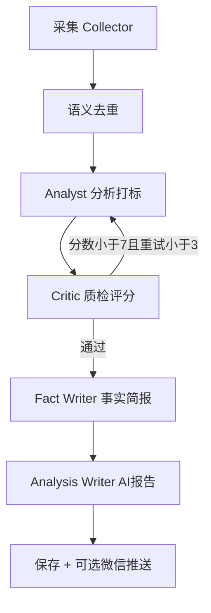

# 中国能源新闻 Agent — 使用手册

本文档基于项目当前代码编写，描述真实的安装、配置、运行与排错方式。

---

## 1. 项目是做什么的

这是一个**每日自动运行的能源新闻 Agent**，面向中国市场，核心流程：

```
采集新闻 → 去重 → AI 分析 → 质量质检 → 生成两份报告
```

| 产出物 | 文件 | 说明 |
|--------|------|------|
| **事实简报（绿微报）** | `data/reports/{日期}/fact_brief.md` | 仅含可溯源事实，每条带来源链接 |
| **AI 分析报告** | `data/reports/{日期}/analysis_report.md` | 基于事实简报推断，标注置信度 |

简报标题格式示例：`# 20260525Econergy绿微报`，末尾带机构页脚（可配置）。

---

## 2. 环境要求

| 项目 | 要求 |
|------|------|
| 操作系统 | Windows / macOS / Linux |
| Python | **3.11 及以上** |
| 网络 | 需访问 DeepSeek API、目标新闻网站、HuggingFace（首次下载模型） |
| 磁盘 | 首次运行约需 **500MB+**（embedding 模型缓存） |
| 内存 | 建议 8GB 及以上 |

---

## 3. 安装步骤

### 3.1 进入项目目录

```powershell
cd C:\Users\18951\Desktop\绿微报
```

（请替换为你本机实际路径。）

### 3.2 创建虚拟环境（推荐）

```powershell
python -m venv .venv
.\.venv\Scripts\Activate.ps1
```

### 3.3 安装依赖

```powershell
pip install -r requirements.txt
```

首次安装可能需 5–15 分钟（含 `sentence-transformers`、`chromadb` 等）。

---

## 4. 配置 `.env`

### 4.1 创建配置文件

```powershell
copy .env.example .env
```

用 Cursor / VS Code 打开 `.env`，**修改后务必 Ctrl+S 保存**，否则程序读到的仍是磁盘上的旧内容。

### 4.2 配置项说明

```ini
# 【必填】DeepSeek API Key — 所有 LLM 分析依赖此项
DEEPSEEK_API_KEY=sk-你的真实密钥

# DeepSeek 接口地址，一般不用改
DEEPSEEK_BASE_URL=https://api.deepseek.com

# 【可选】EIA 美国能源数据 API，用于 WTI / Henry Hub 行情
# 不需要美国行情可留空：EIA_API_KEY=
EIA_API_KEY=

# 【可选】企业微信群机器人 Webhook，留空则不推送
WECHAT_WEBHOOK_URL=

# 每天自动运行时间（24 小时制）
SCHEDULE_HOUR=7
SCHEDULE_MINUTE=0
```

### 4.3 可选高级配置

可在 `.env` 中追加（不填则用默认值）：

```ini
# 语义去重相似度阈值，0.85 表示标题相似度 >85% 视为重复
SIMILARITY_THRESHOLD=0.85

# 每次运行最多保留新闻条数
MAX_NEWS_PER_RUN=50

# Critic 质检：低于此分数打回 Analyst 重试
CRITIC_PASS_SCORE=7.0

# 最多重试次数
CRITIC_RETRY_LIMIT=3

# 简报条数上限
BRIEF_MAX_ITEMS=15

# 面向国内用户：默认关闭 EIA 新闻与行情（需要时改为 true）
ENABLE_EIA_RSS=false
ENABLE_EIA_MARKET=false
BRIEF_EXCLUDED_SOURCES=EIA

# 简报标题与页脚
BRIEF_TITLE_PREFIX=Econergy绿微报
BRIEF_FOOTER=南京绿新能源研究院 竞争情报中心 精选敬赠
```

### 4.4 API Key 获取地址

| Key | 申请地址 | 是否必填 |
|-----|----------|----------|
| DeepSeek | https://platform.deepseek.com | **必填** |
| EIA | https://www.eia.gov/opendata/register.php | 可选 |
| 企业微信 Webhook | 企业微信群 → 群机器人 → 添加机器人 | 可选 |

---

## 5. 运行方式

所有命令均在**项目根目录**下执行。

### 5.1 立即生成一次报告（推荐首次使用）

```powershell
python main.py --run-now
```

**会发生什么：**

1. 从 RSS / 网页采集新闻（约 1–2 分钟）
2. 首次运行下载中文 embedding 模型（约 1–3 分钟，仅首次）
3. 语义去重，写入 SQLite
4. Analyst → Critic → Fact Writer → Analysis Writer（约 1–3 分钟，消耗 DeepSeek 额度）
5. 报告保存到 `data/reports/当天日期/`

**成功标志：** 终端最后一行类似：

```
报告已保存到 ...\data\reports\2026-05-25
```

### 5.2 仅重新生成报告（跳过采集）

当天已经采集过新闻，只想换一版文案或修复配置后重写：

```powershell
python main.py --writers-only
```

从 SQLite 读取当日已有新闻，不再爬网页，但仍会调用 DeepSeek。

### 5.3 启动 Web 界面（Streamlit）

```powershell
python main.py --web-only
```

浏览器打开：**http://localhost:8501**

页面功能：

- **侧边栏**：选择日期
- **左栏**：事实简报 + 行情卡片（如有 EIA 数据）
- **右栏**：AI 分析报告 + 置信度进度条
- **底部**：采集条数、去重条数、Critic 评分、重试次数

### 5.4 生产模式：定时任务 + Web

```powershell
python main.py
```

同时启动：

- **APScheduler**：每天 `SCHEDULE_HOUR:SCHEDULE_MINUTE` 自动跑 pipeline
- **Streamlit**：8501 端口 Web 服务

按 `Ctrl+C` 退出。

---

## 6. 输出文件在哪里

```
绿微报/
├── data/
│   ├── reports/
│   │   └── 2026-05-25/
│   │       ├── fact_brief.md       ← 事实简报（绿微报）
│   │       ├── analysis_report.md  ← AI 分析报告
│   │       └── market_data.json    ← 行情（有 EIA Key 时）
│   ├── logs/
│   │   └── 2026-05-25.log          ← 运行日志
│   └── db/
│       ├── news.db                 ← 新闻与运行元数据
│       └── chroma/                 ← 高分分析策略记忆
```

可直接用 Markdown 编辑器打开 `fact_brief.md`，或在 Streamlit 中查看。

---

## 7. 工作流程详解



| Agent | 模型 | 作用 |
|-------|------|------|
| Collector | 无 | 抓 RSS、网页、EIA 行情 |
| Analyst | deepseek-chat | 分类、摘要、实体提取 |
| Critic | deepseek-v4-pro | 质量打分，不合格打回 |
| Fact Writer | deepseek-chat | 生成绿微报事实简报 |
| Analysis Writer | deepseek-v4-pro | **仅读事实简报**写 AI 分析 |

Critic 评分 ≥ 8 时，分析策略会写入 ChromaDB，供后续 Analyst 参考。

---

## 8. 数据来源（当前实际情况）

| 来源 | 方式 | 当前稳定性 |
|------|------|------------|
| 界面新闻·能源频道 | 网页爬取 | **较稳定**，主要新闻来源 |
| 财联社 RSS | feedparser | 视网络而定，可能 0 条 |
| 澎湃新闻·能源 | 列表页 HTML | 视网络而定 |
| EIA News RSS | feedparser | 视网络而定 |
| 国家能源局 | 网页爬取 | 官网列表页结构复杂，常 0 条 |
| EIA Open Data | REST API | 需有效 `EIA_API_KEY` |

因此：**默认不采集 EIA 新闻**；不配 EIA Key 时「市场行情」显示「暂无行情数据」。新闻主要来自财联社、澎湃、界面新闻等国内源。

---

## 9. 典型使用场景

### 场景 A：每天早上自动出报

1. 配置 `.env` 中 `SCHEDULE_HOUR=7`、`SCHEDULE_MINUTE=0`
2. 运行 `python main.py`，保持窗口/服务不关闭
3. 7:00 自动生成报告，Streamlit 随时查看

### 场景 B：手动试跑

```powershell
python main.py --run-now
```

打开 `data/reports/今天日期/fact_brief.md` 检查内容。

### 场景 C：推送到企业微信群

1. 在企业微信群添加机器人，复制 Webhook URL
2. 写入 `.env`：`WECHAT_WEBHOOK_URL=https://qyapi.weixin.qq.com/...`
3. 每次 pipeline 完成后自动推送简报摘要（前 500 字）

### 场景 D：只改 Prompt 后重写报告

1. 编辑 `agents/prompts/fact_writer.txt` 或 `analysis_writer.txt`
2. 运行 `python main.py --writers-only`（不重新爬网）

---

## 10. 费用与耗时参考

| 项目 | 参考值 |
|------|--------|
| 单次 `--run-now` 总耗时 | 约 **3–10 分钟**（含网页采集 + 首次模型下载） |
| DeepSeek 调用次数 | 约 3–6 次（含 Critic 重试） |
| 第二次起 embedding | 已缓存，明显更快 |

具体 API 费用以 DeepSeek 控制台账单为准。

---

## 11. 常见问题

### Q1：报错 `Authentication Fails, Your api key: ****here is invalid`

- `.env` 里仍是 `your_key_here` 占位符，或**改了没保存**
- 解决：填入真实 Key → **Ctrl+S** → 重新运行
- 验证：`python -c "import config; print(config.DEEPSEEK_API_KEY[:7])"` 应输出 `sk-672` 等，而非 `your_ke`

### Q2：简报「今日要闻」为空或「共 0 条」

- 多为采集到的不是真实新闻（如部门导航页），或 LLM 过于严格删光
- 当前版本已有 formatter 兜底；若仍空，检查 `data/logs/` 日志中采集条数
- 运行 `python main.py --run-now` 重新完整采集

### Q3：EIA 403 / 行情为空

- `EIA_API_KEY` 无效或未配置 → 可留空，不影响新闻简报

### Q4：RSS 采集 0 条

- 网络或源站限制，属常见情况；界面新闻仍可补采

### Q5：修改 `.env` 不生效

- 确认已保存；项目已设置 `load_dotenv(override=True)` 优先读项目根目录 `.env`

### Q6：同一天跑两次会重复吗

- SQLite 按 URL 的 MD5 主键 **覆盖更新**，不会无限堆积
- 报告文件会被**覆盖**为最新一次结果

### Q7：如何停止 Streamlit

- 在运行 `python main.py` 的终端按 `Ctrl+C`

---

## 12. 目录结构速查

```
绿微报/
├── main.py                 # 入口：--run-now / --web-only / --writers-only
├── config.py               # 读取 .env
├── .env                    # 你的密钥（勿提交 Git）
├── requirements.txt
├── collector/              # RSS、网页、EIA、去重
├── agents/                 # LangGraph + LLM Agent
│   └── prompts/            # 可编辑的 Prompt 模板
├── memory/                 # SQLite + ChromaDB
├── output/                 # 格式化、企业微信推送
├── web/app.py              # Streamlit 页面
└── data/                   # 报告、日志、数据库
```

---

## 13. 安全建议

1. **不要**将 `.env` 提交到 Git 或发给他人
2. API Key 泄露后，立即在 DeepSeek 控制台**作废并重新生成**
3. 企业微信 Webhook URL 等同群消息发送权限，需妥善保管

---

## 14. 快速命令备忘

```powershell
# 安装
pip install -r requirements.txt

# 配置
copy .env.example .env
# 编辑 .env 后 Ctrl+S 保存

# 首次/手动生成
python main.py --run-now

# 只重写报告
python main.py --writers-only

# 只看 Web
python main.py --web-only

# 定时 + Web
python main.py
```

---

## 15. 获取帮助

1. 查看 `data/logs/当天.log` 完整日志
2. 检查 `data/reports/当天/` 是否生成 md 文件
3. 确认 DeepSeek 账户有余额且 Key 有效

如需扩展数据源、调整简报版式或对接内部系统，可在 Agent 模式下继续改代码。
