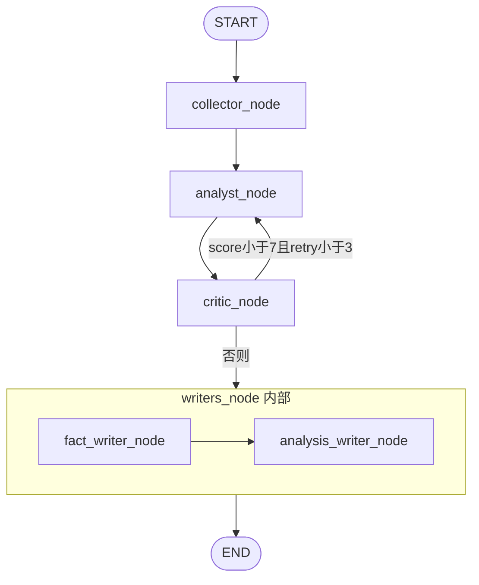

# 中国能源新闻 Agent — 技术文档

本文档面向开发者与维护人员，描述系统架构、模块设计、数据模型、流水线逻辑与扩展方式。代码版本对应当前仓库实现。

---

## 1. 系统概述

### 1.1 定位

基于 **LangGraph** 的多 Agent 流水线，实现能源新闻的自动采集、语义去重、LLM 结构化分析、质量质检与双报告生成。

### 1.2 技术栈

| 层级 | 技术 | 用途 |
|------|------|------|
| 语言 | Python 3.11+ | 全栈实现 |
| Agent 编排 | LangGraph (`langgraph>=0.2`) | StateGraph 流水线 |
| LLM | DeepSeek API（OpenAI 兼容） | `deepseek-chat` / `deepseek-v4-pro`（Critic、Analysis Writer） |
| LLM 封装 | langchain-openai | ChatOpenAI 统一调用 |
| 采集 | feedparser, requests, BeautifulSoup | RSS / 网页 |
| 中文 NLP | jieba | 能源关键词过滤 |
| 向量化 | sentence-transformers | 标题语义去重 |
| 向量库 | ChromaDB | Skill Memory |
| 关系库 | SQLite3 | 新闻与运行元数据 |
| 调度 | APScheduler | Cron 定时任务 |
| 前端 | Streamlit | 报告浏览 |
| 配置 | python-dotenv | `.env` 环境变量 |

### 1.3 设计原则

1. **事实与分析隔离**：`Analysis Writer` 仅读取 `fact_brief`，不接触原始新闻。
2. **Prompt 外置**：所有 Agent system prompt 存放在 `agents/prompts/*.txt`。
3. **LLM 统一入口**：`agents/llm_client.py` 封装模型切换与 JSON 解析。
4. **单源失败隔离**：Collector 各函数独立 `try/except`，不阻断整体。
5. **兜底生成**：Fact Writer LLM 输出无效时，由 `output/formatter.py` 确定性生成简报。

---

## 2. 系统架构

### 2.1 分层结构

```
┌─────────────────────────────────────────────────────────┐
│  Presentation   │  main.py  │  web/app.py (Streamlit) │
├─────────────────────────────────────────────────────────┤
│  Orchestration  │  agents/graph.py (LangGraph)          │
├─────────────────────────────────────────────────────────┤
│  Agents         │  collector_agent, analyst, critic,    │
│                 │  fact_writer, analysis_writer         │
├─────────────────────────────────────────────────────────┤
│  Collector      │  rss_fetcher, web_scraper,            │
│                 │  api_fetcher, deduplicator            │
├─────────────────────────────────────────────────────────┤
│  Memory         │  news_store (SQLite), skill_memory    │
│                 │  (ChromaDB)                           │
├─────────────────────────────────────────────────────────┤
│  Output         │  formatter, notifier                  │
├─────────────────────────────────────────────────────────┤
│  Config         │  config.py + .env                     │
└─────────────────────────────────────────────────────────┘
```

### 2.2 目录结构

```
绿微报/
├── main.py                     # CLI 入口、调度器、Streamlit 子进程
├── config.py                   # 配置加载与目录初始化
├── collector/
│   ├── rss_fetcher.py          # 财联社 / 澎湃 / EIA RSS
│   ├── web_scraper.py          # 界面新闻 / 国家能源局
│   ├── api_fetcher.py          # EIA Open Data 行情
│   └── deduplicator.py         # 标题向量语义去重
├── agents/
│   ├── graph.py                # LangGraph 主图
│   ├── llm_client.py           # LLM 统一封装
│   ├── collector_agent.py      # 采集编排
│   ├── analyst_agent.py
│   ├── critic_agent.py
│   ├── fact_writer.py
│   ├── analysis_writer.py
│   └── prompts/                # 外置 Prompt 模板
├── memory/
│   ├── news_store.py           # SQLite
│   └── skill_memory.py         # ChromaDB
├── output/
│   ├── formatter.py            # Markdown 模板与兜底简报
│   └── notifier.py             # 企业微信 Webhook
├── web/
│   └── app.py                  # Streamlit UI
└── data/
    ├── energy_keywords.txt
    ├── reports/{YYYY-MM-DD}/
    ├── logs/
    └── db/
        ├── news.db
        └── chroma/
```

---

## 3. 核心流水线（LangGraph）

### 3.1 状态定义

`AgentState`（`agents/graph.py`）：

| 字段 | 类型 | 说明 |
|------|------|------|
| `news_items` | `list[dict]` | 去重后的原始新闻 |
| `analyzed_items` | `list[dict]` | Analyst 结构化结果 |
| `critic_score` | `float` | Critic 综合评分 0–10 |
| `critic_feedback` | `str` | Critic 反馈，供 Analyst 重试 |
| `retry_count` | `int` | 已重试次数 |
| `fact_brief` | `str` | 事实简报 Markdown |
| `analysis_report` | `str` | AI 分析报告 Markdown |
| `market_data` | `list[dict]` | EIA 行情 |
| `run_date` | `str` | 运行日期 `YYYY-MM-DD` |
| `collected_count` | `int` | 采集原始条数 |
| `deduped_count` | `int` | 去重后条数 |
| `strategy_note` | `str` | Analyst 策略摘要（写入 Skill Memory） |
| `passed` | `bool` | Critic 是否通过 |

### 3.2 图结构



**节点说明：**

| 节点 | 函数 | 行为 |
|------|------|------|
| `collector_node` | `collector_agent.run_collection` | 若 state 已有 `news_items` 则跳过（重试 Analyst 时不重复采集） |
| `analyst_node` | `analyst_agent.run_analyst` | 召回 Skill Memory → LLM JSON 分析 |
| `critic_node` | `critic_agent.run_critic` | DeepSeek-R1 评分；未通过时 `retry_count += 1` |
| `writers_node` | 顺序调用 fact + analysis | 先事实简报，再 AI 报告 |

**条件路由**（`route_after_critic`）：

```python
if score < CRITIC_PASS_SCORE and retry_count < CRITIC_RETRY_LIMIT:
    return "analyst_node"
return "writers"
```

默认：`CRITIC_PASS_SCORE=7.0`，`CRITIC_RETRY_LIMIT=3`。

### 3.3 流水线结束后处理（`_save_outputs`）

1. 写入 `data/reports/{run_date}/fact_brief.md`
2. 写入 `data/reports/{run_date}/analysis_report.md`
3. 若有行情，写入 `market_data.json`
4. 更新 SQLite `runs` 表
5. 若 `critic_score >= 8` 且有 `strategy_note`，写入 ChromaDB Skill Memory
6. 若配置 `WECHAT_WEBHOOK_URL`，调用企业微信推送

### 3.4 入口函数

```python
run_pipeline(run_date: str | None = None, skip_collect: bool = False) -> AgentState
```

- `skip_collect=False`：完整采集（默认）
- `skip_collect=True`：从 SQLite 加载当日 `news_items`，跳过 `collector_node` 内的采集逻辑（因 state 预填 `news_items`，collector 直接 return）

---

## 4. 数据采集层（Collector）

### 4.1 新闻数据结构

所有采集模块统一输出：

```python
{
    "id": str,           # md5(url)
    "title": str,
    "content": str,      # 正文或摘要
    "url": str,
    "source": str,       # "财联社" / "澎湃" / "界面新闻" / "国家能源局" / "EIA"
    "published_at": str, # ISO 8601
    "category": str,     # 初始 "unknown"，Analyst 填写
    "tags": list[str],   # 初始 []
}
```

### 4.2 RSS 采集（`collector/rss_fetcher.py`）

| 函数 | 来源 | URL |
|------|------|-----|
| `fetch_cls_rss` | 财联社 | `https://www.cls.cn/rss` |
| `fetch_thepaper_energy` | 澎湃新闻·能源 | `https://www.thepaper.cn/channel_25950`（HTML 列表） |
| `fetch_eia_rss` | EIA News | `https://www.eia.gov/rss/news.xml` |

**过滤逻辑：**

- 使用 `data/energy_keywords.txt` + jieba 分词做能源相关度过滤
- EIA RSS 英文内容跳过关键词过滤（`skip_keyword_filter=True`）
- 各源独立异常捕获，失败返回 `[]`

### 4.3 网页采集（`collector/web_scraper.py`）

| 函数 | 来源 | 说明 |
|------|------|------|
| `fetch_jiemian_energy` | 界面新闻能源频道 | `https://www.jiemian.com/lists/2.html`，逐篇抓正文 |
| `fetch_nea_announcements` | 国家能源局 | 多列表页尝试，过滤 `/sjzz/` 等部门导航 |

**实现要点：**

- 统一 `User-Agent`（`config.USER_AGENT`）
- 请求间隔 `time.sleep(2)` 秒
- 政府网站 GBK 编码：`resp.encoding = apparent_encoding or 'gbk'`
- `_is_valid_news_link()` 过滤 index 页、部门页、过短标题
- 界面能源频道不做二次关键词过滤（频道本身已聚焦能源）

### 4.4 行情 API（`collector/api_fetcher.py`）

| 函数 | EIA 端点 | 指标 |
|------|----------|------|
| `fetch_wti_prices` | `petroleum/pri/spt/data` | WTI 原油（series: RWTC） |
| `fetch_henry_hub_prices` | `natural-gas/pri/sum/data` | Henry Hub（series: RNGWHHD） |

返回结构：

```python
{
    "metric": "WTI原油",
    "value": 78.4,
    "unit": "USD/桶",
    "date": "2026-05-25",
    "change_pct": 1.2   # 与前一日对比，可能为 None
}
```

- 无 `EIA_API_KEY` 时跳过并 log warning
- 成功结果缓存至 `data/reports/{date}/market_data.json`

### 4.5 语义去重（`collector/deduplicator.py`）

**算法：**

1. 按 `published_at` 升序排序（保留最早发布）
2. 使用 `shibing624/text2vec-base-chinese` 对标题 embedding
3. 贪心比对：与已保留条目余弦相似度 > `SIMILARITY_THRESHOLD`（默认 0.85）则丢弃
4. 截断至 `MAX_NEWS_PER_RUN`（默认 50）

**性能：**

- 模型懒加载，单例 `_model`
- 首次运行需从 HuggingFace 下载约 409MB

### 4.6 采集编排（`agents/collector_agent.py`）

```python
def run_collection(run_date) -> dict:
    raw = rss + web
    market = api_fetcher.fetch_market_data()
    deduped = deduplicator.deduplicate(raw)
    news_store.save_news(deduped, run_date)
    news_store.save_run_meta(..., status="collecting")
    return {news_items, market_data, run_date, collected_count, deduped_count}
```

---

## 5. Agent 层

### 5.1 LLM 客户端（`agents/llm_client.py`）

| 函数 | 模型 | 用途 |
|------|------|------|
| `get_chat_client()` | `deepseek-chat` | Analyst, Fact Writer |
| `get_reasoner_client()` | `deepseek-v4-pro`（可配置） | Critic |
| `get_analysis_client()` | `deepseek-v4-pro`（可配置） | Analysis Writer |
| `invoke_text(client, system, user)` | — | 返回纯文本 |
| `invoke_json(client, system, user)` | — | 解析 JSON，失败重试 1 次 |
| `load_prompt(name, **kwargs)` | — | 从 `agents/prompts/{name}.txt` 加载并 format |

**JSON 解析：**

- 自动剥离 markdown code fence（` ```json ... ``` `）
- 解析失败时追加一条 HumanMessage 要求纯 JSON 输出

### 5.2 Analyst（`agents/analyst_agent.py`）

**输入：** `news_items`, `run_date`, `critic_feedback`（重试时）

**流程：**

1. `skill_memory.recall_similar_skills(run_date, top_k=3)` 召回历史高分策略
2. 调用 `deepseek-chat`，期望 JSON：

```json
{
  "items": [
    {
      "id": "...",
      "category": "oil|gas|renewables|policy|market",
      "tags": [],
      "entities": [],
      "summary": "80字以内摘要"
    }
  ],
  "strategy_note": "本次分析策略"
}
```

3. 按 `id` 合并原始新闻字段；`id` 不匹配时按列表索引 fallback
4. 若 LLM 返回空 `items`，fallback 为原始 `news_items`

### 5.3 Critic（`agents/critic_agent.py`）

**模型：** `deepseek-v4-pro`（thinking + `reasoning_effort=high`，可通过 `DEEPSEEK_CRITIC_MODEL` 配置）

**评分维度（Prompt 定义）：**

- 完整性 3 分
- 准确性 4 分
- 推断词检测：每个推断词扣 2 分

**返回：**

```json
{"score": 8.5, "feedback": "...", "passed": true}
```

### 5.4 Fact Writer（`agents/fact_writer.py`）

**输出格式：** 绿微报 Markdown（见 `agents/prompts/fact_writer.txt`）

**兜底机制：**

```python
if is_brief_empty(brief):
    brief = build_fact_brief_lvwbao(run_date, analyzed_items, market_data)
```

`is_brief_empty()` 判定：长度过短、`共 0 条`、今日要闻节为空。

### 5.5 Analysis Writer（`agents/analysis_writer.py`）

**输入隔离：** 仅接收 `fact_brief` 字符串，不含原始新闻 JSON。

**输出：** 3–5 条分析，每条附 `【置信度：XX%】`，开头含 AI 免责声明。

---

## 6. 存储层

### 6.1 SQLite（`memory/news_store.py`）

**路径：** `data/db/news.db`

**表 `news`：**

| 列 | 类型 | 说明 |
|----|------|------|
| id | TEXT PK | md5(url) |
| title | TEXT | 标题 |
| content | TEXT | 正文/摘要 |
| url | TEXT | 原文链接 |
| source | TEXT | 来源名 |
| published_at | TEXT | ISO 8601 |
| category | TEXT | 分类 |
| tags | TEXT | JSON 数组字符串 |
| run_date | TEXT | 所属运行日 |

写入策略：`INSERT OR REPLACE`（同 URL 覆盖，不重复堆积）。

**表 `runs`：**

| 列 | 类型 | 说明 |
|----|------|------|
| run_date | TEXT PK | 日期 |
| collected | INTEGER | 原始采集数 |
| deduped | INTEGER | 去重后数 |
| critic_score | REAL | 最终 Critic 分 |
| retry_count | INTEGER | 重试次数 |
| status | TEXT | collecting / completed |

### 6.2 ChromaDB Skill Memory（`memory/skill_memory.py`）

**路径：** `data/db/chroma/`

**Collection：** `analysis_skills`（cosine 空间）

**写入条件：** `critic_score >= 8` 且存在 `strategy_note`

**文档格式：**

```
日期: 2026-05-25
策略: {analyst_strategy}
评分: 10.0
```

**召回：** Analyst 启动时 query `"日期: {current_date} 能源新闻分析策略"`，top_k=3。

---

## 7. 输出层

### 7.1 Formatter（`output/formatter.py`）

| 函数 | 用途 |
|------|------|
| `format_market_table` | 行情 Markdown 表格 |
| `build_fact_brief_lvwbao` | 确定性绿微报生成（兜底） |
| `is_brief_empty` | 检测 LLM 简报是否有效 |

绿微报结构：

```markdown
# {YYYYMMDD}Econergy绿微报
> 本简报仅含可溯源事实，共 N 条，来源 ...

## 市场行情
...

## 今日要闻

1、...【来源：界面新闻】[查看原文](url)

{页脚}
```

### 7.2 Notifier（`output/notifier.py`）

- 条件：`WECHAT_WEBHOOK_URL` 非空
- 协议：企业微信机器人 Webhook，msgtype=markdown
- 内容：简报前 500 字 + 固定尾注

---

## 8. 配置系统（`config.py`）

**加载方式：**

```python
load_dotenv(BASE_DIR / ".env", override=True)
```

`override=True` 确保项目 `.env` 优先于系统环境变量。

**完整配置项：**

| 变量 | 默认值 | 说明 |
|------|--------|------|
| `DEEPSEEK_API_KEY` | `""` | DeepSeek API Key |
| `DEEPSEEK_BASE_URL` | `https://api.deepseek.com` | API Base URL |
| `EIA_API_KEY` | `""` | EIA Open Data Key |
| `WECHAT_WEBHOOK_URL` | `""` | 企业微信 Webhook |
| `SCHEDULE_HOUR` | `7` | 定时小时 |
| `SCHEDULE_MINUTE` | `0` | 定时分钟 |
| `CHROMA_DB_PATH` | `data/db/chroma` | Chroma 路径 |
| `SQLITE_DB_PATH` | `data/db/news.db` | SQLite 路径 |
| `SIMILARITY_THRESHOLD` | `0.85` | 去重阈值 |
| `MAX_NEWS_PER_RUN` | `50` | 最大新闻条数 |
| `CRITIC_RETRY_LIMIT` | `3` | Critic 最大重试 |
| `CRITIC_PASS_SCORE` | `7.0` | Critic 及格线 |
| `BRIEF_FOOTER` | 南京绿新能源研究院... | 简报页脚 |
| `BRIEF_TITLE_PREFIX` | `Econergy绿微报` | 简报标题后缀 |
| `BRIEF_MAX_ITEMS` | `15` | 简报最大条数（LLM 与 formatter 兜底共用） |

启动时自动创建：`data/reports/`、`data/logs/`、`data/db/`。

---

## 9. 入口与调度（`main.py`）

| CLI 参数 | 行为 |
|----------|------|
| （无） | APScheduler Cron + Streamlit 子进程 |
| `--run-now` | 同步执行 `run_pipeline()` |
| `--writers-only` | `run_pipeline(skip_collect=True)` |
| `--web-only` | 仅 `streamlit run web/app.py --server.port 8501` |

**日志：**

- 文件：`data/logs/{YYYY-MM-DD}.log`
- 控制台：同步输出
- 级别：INFO

**Streamlit：** 通过 `subprocess.Popen` 启动，工作目录为项目根。

---

## 10. Web 层（`web/app.py`）

**框架：** Streamlit，`layout="wide"`

**数据源：**

- 报告 Markdown：`data/reports/{date}/`
- 运行元数据：SQLite `runs` 表
- 行情：`market_data.json`

**功能：**

- `list_report_dates()`：合并 reports 目录与 DB 日期
- `render_confidence_bars()`：正则提取 `【置信度：XX%】`，渲染 `st.progress`

---

## 11. Prompt 管理

**位置：** `agents/prompts/`

| 文件 | 使用者 | 占位符 |
|------|--------|--------|
| `analyst.txt` | Analyst | `{date}` |
| `critic.txt` | Critic | `{pass_score}` |
| `fact_writer.txt` | Fact Writer | `{date}`, `{date_compact}`, `{footer}` |
| `analysis_writer.txt` | Analysis Writer | `{date}` |

**注意：** Prompt 内 JSON 示例花括号需双写转义（`{{` `}}`），避免被 Python `str.format` 误解析。

---

## 12. 依赖关系图

```mermaid
flowchart LR
    main --> graph
    graph --> collector_agent
    graph --> analyst_agent
    graph --> critic_agent
    graph --> fact_writer
    graph --> analysis_writer
    graph --> news_store
    graph --> skill_memory
    graph --> notifier

    collector_agent --> rss_fetcher
    collector_agent --> web_scraper
    collector_agent --> api_fetcher
    collector_agent --> deduplicator
    collector_agent --> news_store

    analyst_agent --> llm_client
    analyst_agent --> skill_memory
    critic_agent --> llm_client
    fact_writer --> llm_client
    fact_writer --> formatter
    analysis_writer --> llm_client

    web --> news_store
    web --> config
```

---

## 13. 扩展指南

### 13.1 新增新闻源

1. 在 `collector/` 下实现 `fetch_xxx() -> list[dict]`，遵循统一数据结构
2. 在 `collector_agent.run_collection()` 中 `extend` 合并
3. 独立 `try/except`，失败返回 `[]`
4. 可选：在 `data/energy_keywords.txt` 补充关键词

### 13.2 更换 LLM 提供商

修改 `agents/llm_client.py` 中 `get_chat_client` / `get_reasoner_client` / `get_analysis_client` 的 `model`、`base_url`、`api_key` 即可，Agent 层无需改动。

### 13.3 调整简报格式

1. 编辑 `agents/prompts/fact_writer.txt`（LLM 路径）
2. 编辑 `output/formatter.py` 中 `build_fact_brief_lvwbao`（兜底路径）
3. 调整 `config.BRIEF_MAX_ITEMS`、`BRIEF_FOOTER` 等

### 13.4 新增 Critic 维度

编辑 `agents/prompts/critic.txt`，并在 `critic_agent.py` 中确保 JSON 字段与 graph 路由逻辑一致。

### 13.5 部署为后台服务

生产环境建议：

- 使用 `systemd` / Windows 任务计划程序运行 `python main.py`
- 或分离调度与 Web：Cron 跑 `--run-now`，Nginx 反代 Streamlit
- `.env` 权限设为仅所有者可读
- 日志轮转：`data/logs/` 定期归档

---

## 14. 已知限制与风险

| 限制 | 说明 |
|------|------|
| RSS 可用性 | 财联社/EIA RSS 受网络与源站影响，可能 0 条 |
| 能源局爬虫 | 列表页多为 JS/复杂结构，当前常抓不到有效新闻 |
| 单进程调度 | APScheduler 与 Streamlit 同进程，不适合高并发 |
| LLM 成本 | Critic、Analysis Writer 使用 deepseek-v4-pro，单次 pipeline 多次 API 调用 |
| 编码 | 部分政府网站 GBK，已做 apparent_encoding 处理，仍可能有个别乱码 |
| Chroma 首次 | 首次写入 Skill Memory 会下载 ONNX embedding（约 79MB） |
| 内存 | sentence-transformers 模型常驻内存，约 500MB+ |

---

## 15. 测试与调试

### 15.1 验证配置加载

```powershell
python -c "import config; print(config.DEEPSEEK_API_KEY[:7], len(config.DEEPSEEK_API_KEY))"
```

### 15.2 验证 DeepSeek 连通

```powershell
python -c "from openai import OpenAI; import config; c=OpenAI(api_key=config.DEEPSEEK_API_KEY, base_url=config.DEEPSEEK_BASE_URL); print(c.chat.completions.create(model='deepseek-chat', messages=[{'role':'user','content':'hi'}], max_tokens=5).choices[0].message.content)"
```

### 15.3 仅测试采集

```powershell
python -c "from agents.collector_agent import run_collection; r=run_collection(); print(r['collected_count'], r['deduped_count'])"
```

### 15.4 查看 SQLite

```powershell
sqlite3 data/db/news.db "SELECT run_date, COUNT(*) FROM news GROUP BY run_date;"
sqlite3 data/db/news.db "SELECT * FROM runs;"
```

### 15.5 日志位置

```
data/logs/2026-05-25.log
```

---

## 16. 相关文档

- 用户使用说明：[`docs/使用手册.md`](使用手册.md)
- 原始需求规格：[`cursor_prompt_energy_agent.md`](../cursor_prompt_energy_agent.md)

---

## 17. 版本信息

| 项 | 值 |
|----|-----|
| 文档对应代码 | 绿微报 Agent 当前实现 |
| LangGraph | >= 0.2 |
| 默认 LLM | DeepSeek Chat / Reasoner |
| 简报品牌 | Econergy绿微报 |
